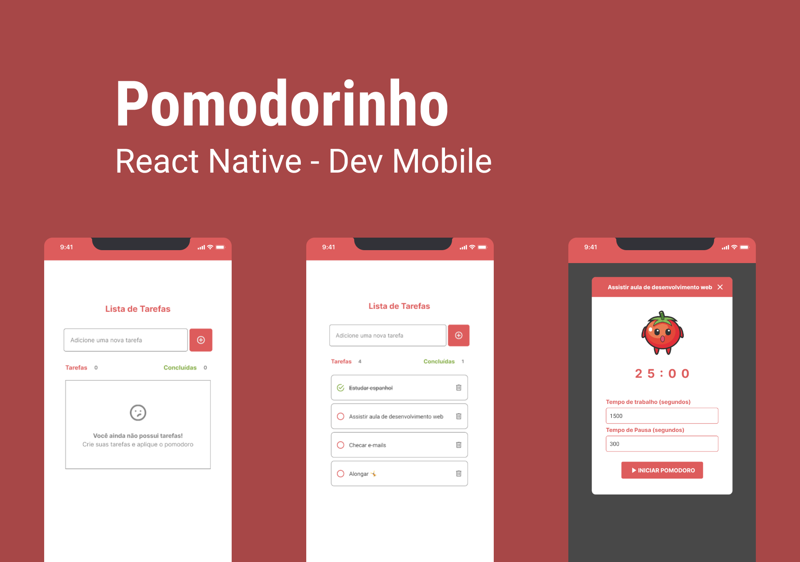
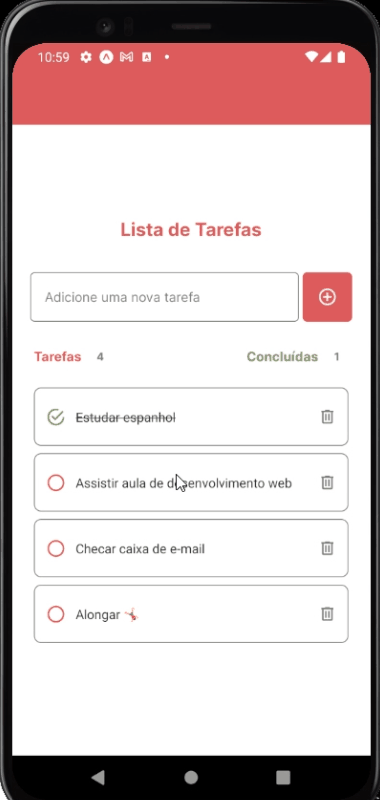
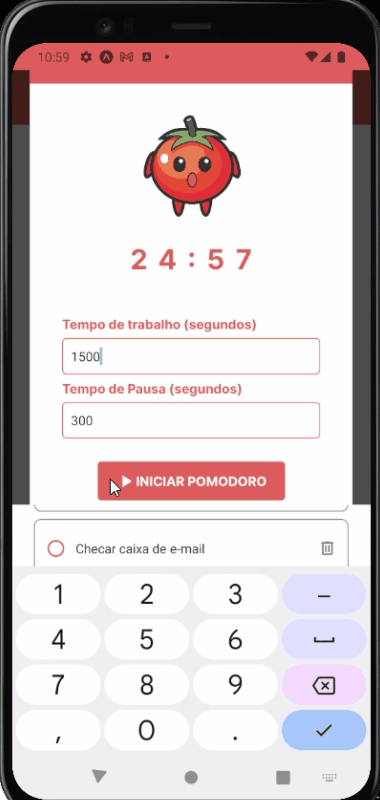
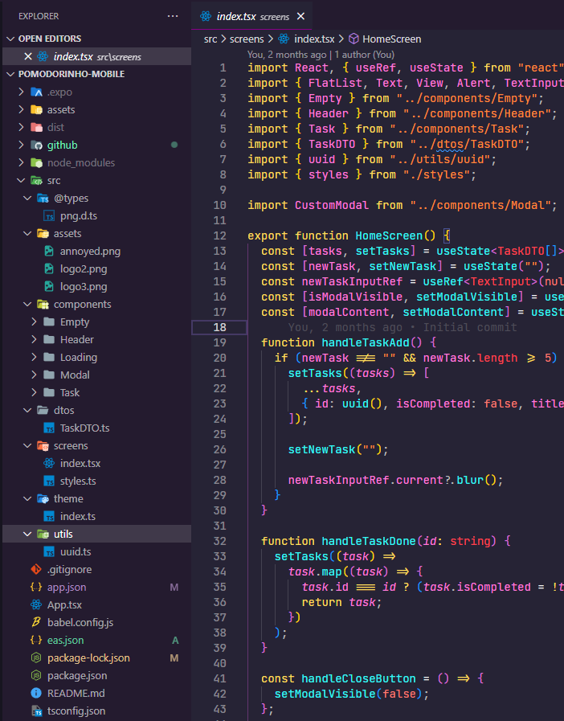

<h1 align="center">
    🍅 Pomodorinho 🍅
</h1>

<div align="center">
    <a href="http://www.cefet-rj.br/" target="_blank">
      
    </a>
    <a href="https://github.com/PedroCantanhede" target="_blank">
      
    </a>
     
    
    
</div>

<p align="center">
  
</p>

# Pomodorinho

Esse aplicativo foi desenvolvido na disciplina de desenvolvimento de aplicativos no CEFET / RJ, minha faculdade. Seu objetivo é ajudar os usuários a gerenciar seu tempo de forma mais eficiente, aumentar a produtividade e alcançar suas metas pessoais e profissionais, combinando a técnica Pomodoro com uma lista de tarefas organizada.

# 🔨 Tecnologias

💻 React Native

💻 TypeScript

💻 CSS

💻 Android Studio


# 🔨 Funcionalidades

✅ Adicionar tarefas

✅ Marcar como concluídas

✅ Deletar tarefas

✅ Exibir modal com contador do Pomodoro

✅ Permitir usuário manipular contador


## :camera: Veja:

### Mobile (Responsividade)






### Estrutura do Projeto:



## :rocket: Instalação

```bash
# Clone o repositório em alguma pasta
$ git clone https://github.com/PedroCantanhede/Pomodorinho.git

# Instale as dependências
$ npm i

# Execute o projeto
$ npm start

# Inicie o projeto no seu celular ou em um simulador via EXPO

```
